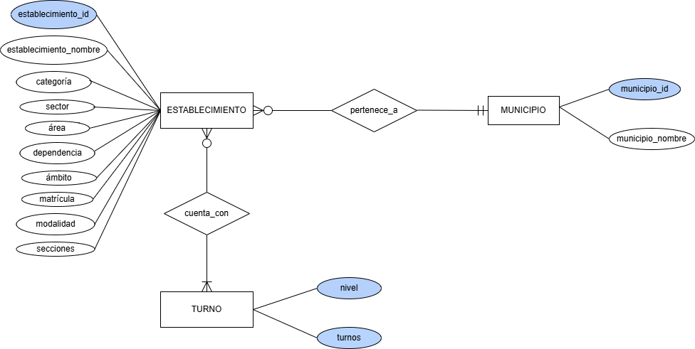
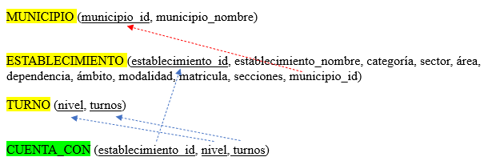

```{r setup, include=FALSE}
setwd("C:/Users/Usuario/Documents/DATOS")
data <- read.csv("establecimientos-educativos-28042025.csv")
library(ggplot2)
library(dplyr)
library("gridExtra")
View(data)
```

### Ejercicio 1

#### DER



### Ejercicio 2

#### Modelo relacional del DER



### Ejercicio 3

Respondemos a las preguntas A, B Y C

A. ¿Cómo es la distribución de cantidad de establecimientos educativos en la PBA por
categoría, área y ámbito?

```{r, echo = FALSE, message = FALSE}

barras_categoria <- ggplot(data, aes(x= categoria)) + geom_bar(fill= " skyblue", color = "black")+labs(y="Cantidad de establecimientos educativos")
barras_categoria
  
barras_area <- ggplot(data, aes(x=area))+ geom_bar(fill="red", color="black")+labs(y="Cantidad de establecimientos educativos")
barras_area

barras_ambito <- ggplot(data, aes(x = ambito)) + geom_bar(fill="green", color= "black")+labs(y="Cantidad de establecimientos educativos")
barras_ambito

grafico_unificado <- grid.arrange(barras_categoria, barras_area, barras_ambito, ncol=3,top="Cantidad de establecimientos en la PBA por categoria ,area y ambito") 
grafico_unificado 
```
B. ¿Existe alguna relación entre la matrícula y la cantidad de secciones de un
establecimiento. ¿Qué ocurre si se analiza discriminando por modalidad, área,
sector, etc.?

```{r, echo = FALSE, message = FALSE}
ggplot(data, aes(x = secciones, y = matricula)) +geom_point()+ geom_smooth(method = "lm") +facet_wrap(~ modalidad,scales = "free") + labs(title="Relación entre secciones y matrículas en establecimientos educativos de la PBA")
datos_por_modalidad <- data %>% group_by(modalidad) %>% count() %>% arrange(n)
datos_por_modalidad

datos_modalidad_educacion_especial <- data %>% filter(modalidad == "Educación Especial")
ggplot(datos_modalidad_educacion_especial, aes(x=secciones, y=matricula)) + geom_point()
View(datos_modalidad_educacion_especial)

datos_modalidad_comunitaria_y_pedagogia<- data %>% filter(modalidad == "Psicología Comunitaria y Pedagogía Social")
ggplot(datos_modalidad_comunitaria_y_pedagogia, aes(x=secciones, y=matricula)) + geom_point()
 
ggplot(data, aes(x = secciones, y = matricula)) + geom_point() + geom_smooth(method = "lm") +facet_wrap(~ area) 

ggplot(data, aes(x = secciones, y = matricula)) + geom_point() + geom_smooth(method = "lm") +facet_wrap(~ sector) 
  
ggplot(data, aes(x = secciones, y = matricula)) + geom_point() + geom_smooth(method = "lm") +facet_wrap(~ nivel) 

datos_por_nivel <- data %>% group_by(nivel) %>% count() %>% arrange(n)
datos_por_nivel
```
C. ¿Cuántos estudiantes y cuántas secciones tienen en promedio los establecimientos
de una misma dependencia? ¿Cómo es la variabilidad? En especial interesa analizar
las dependencias que tengan más de 500 establecimientos bajo su órbita, mientras
que el resto puede ser analizado en conjunto como una categoría “otro” (en
referencia a otro tipo de dependencia).

```{r,echo = FALSE, message = FALSE}
df_otras_dependencias <- data %>%
  mutate(dependencia = case_when(
    dependencia %in% c("Municipal", "Nacional","Otros Organismos") ~ "Otro",
    TRUE ~ dependencia
  ))

datos_por_dependencia <- df_otras_dependencias %>% group_by(dependencia) %>% summarise(
  promedio_estudiantes = mean(matricula),
  sd_estudiantes = sd(matricula),
  promedio_secciones = mean(secciones),
  sd_secciones = sd(secciones),
  count = n())

datos_por_dependencia


datos_dependencia_mayores_a_500 <- datos_por_dependencia %>% filter(dependencia == "Oficial" | dependencia == "Privada")
datos_dependencia_mayores_a_500

datos_otras_dependencias<- datos_por_dependencia %>% filter(dependencia != "Oficial" & dependencia != "Privada")
datos_otras_dependencias

ggplot(datos_por_dependencia, aes(x=dependencia, y =promedio_estudiantes))+ geom_bar(stat="identity", position = "dodge")+
  geom_errorbar(aes(ymin = promedio_estudiantes-sd_estudiantes, ymax = promedio_estudiantes + sd_estudiantes),width=0.2) + theme_minimal()

ggplot(datos_por_dependencia, aes(x=dependencia, y =promedio_secciones))+ geom_bar(stat="identity", position = "dodge")+
  geom_errorbar(aes(ymin = promedio_secciones-sd_secciones, ymax = promedio_secciones + sd_secciones),width=0.2) + theme_minimal()


bp_estudiantes_dependencias_mas_500 <- ggplot(datos_dependencia_mayores_a_500, aes(x=dependencia, y =promedio_estudiantes))+ geom_bar(stat="identity", position = "dodge")+
  geom_errorbar(aes(ymin = promedio_estudiantes-sd_estudiantes, ymax = promedio_estudiantes + sd_estudiantes),width=0.2) + theme_minimal()

bp_estudiantes_otras_dependencias <- ggplot(datos_otras_dependencias, aes(x=dependencia, y =promedio_estudiantes))+ geom_bar(stat="identity", position = "dodge")+
  geom_errorbar(aes(ymin = promedio_estudiantes-sd_estudiantes, ymax = promedio_estudiantes + sd_estudiantes),width=0.2) + theme_minimal()


bp_secciones_dependencias_mas_500 <- ggplot(datos_dependencia_mayores_a_500, aes(x=dependencia, y =promedio_secciones))+ geom_bar(stat="identity", position = "dodge")+
  geom_errorbar(aes(ymin = promedio_secciones-sd_secciones, ymax = promedio_secciones + sd_secciones),width=0.2) + theme_minimal()


bp_secciones_otras_dependencias <- ggplot(datos_otras_dependencias, aes(x=dependencia, y =promedio_secciones))+ geom_bar(stat="identity", position = "dodge")+
  geom_errorbar(aes(ymin = promedio_secciones-sd_secciones, ymax = promedio_secciones + sd_secciones),width=0.2) + theme_minimal()

grid.arrange(bp_estudiantes_dependencias_mas_500, bp_estudiantes_otras_dependencias, nrow = 2)

grid.arrange(bp_secciones_dependencias_mas_500, bp_secciones_otras_dependencias, nrow = 2)

```

### Ejercicio 4

Consigna: ¿Cómo procederían para poder responder la Pregunta “D”? ¿Consideran que existe una
forma más adecuada de ofrecer los datos que mediante un único esquema (tabla)?
Fundamenten su respuesta y relacionarla con el DER o el mapeo al Modelo Relacional
propuesto en la Parte A.

D. ¿Cómo se caracteriza la oferta de turnos para cada uno de los niveles educativos?
¿Varía según área, sector y el tipo de dependencia?

```{r, echo = FALSE, message = FALSE}

datos_nivel_turnos <- data %>% group_by(nivel,turnos) %>% count()
datos_nivel_turnos

library(tidyr)
data_turnos <- separate_rows(data, turnos, sep = ",") %>%
  mutate(turnos = trimws(turnos))

mas_importantes <- data_turnos %>% filter(nivel == "Nivel Inicial" | nivel == "Nivel Primario"| nivel =="Nivel Secundario" | nivel == "Formación Profesional")
menos_importantes <- data_turnos %>% filter(nivel != "Nivel Inicial" & nivel != "Nivel Primario" & nivel !="Nivel Secundario" & nivel != "Formación Profesional")

  
ggplot(mas_importantes, aes(x = nivel, fill = turnos)) +
  geom_bar() +
  labs(title = "Relacion entre Nivel y Turno",
       x = "Nivel Educativo",
       y = "Cantidad de Establecimientos",
       fill = "Turno") +
  theme_minimal()

ggplot(menos_importantes, aes(x = nivel, fill = turnos)) +
  geom_bar() +
  labs(title = "Relacion entre Nivel y Turno",
       x = "Nivel Educativo",
       y = "Cantidad de Establecimientos",
       fill = "Turno") +
  theme_minimal() + 
  theme(axis.text.x = element_text(angle = 45, hjust = 1))


ggplot(mas_importantes, aes(x = nivel, fill = turnos)) +
  geom_bar() +
  facet_wrap(~ area) +
  labs(title = "Relacion entre Nivel y Turno por area",
       x = "Nivel Educativo",
       y = "Cantidad de Establecimientos",
       fill = "Turno") +
  theme_minimal() + 
  theme(axis.text.x = element_text(angle = 45, hjust = 1))  

ggplot(menos_importantes, aes(x = nivel, fill = turnos)) +
  geom_bar() +
  facet_wrap(~ area) +
  labs(title = "Relacion entre Nivel y Turno por area",
       x = "Nivel Educativo",
       y = "Cantidad de Establecimientos",
       fill = "Turno") +
  theme_minimal() + 
  theme(axis.text.x = element_text(angle = 45, hjust = 1))  

# ahora por sector


ggplot(mas_importantes, aes(x = nivel, fill = turnos)) +
  geom_bar() +
  facet_wrap(~ sector) +
  labs(title = "Relacion entre Nivel y Turno por sector",
       x = "Nivel Educativo",
       y = "Cantidad de Establecimientos",
       fill = "Turno") +
  theme_minimal() + 
  theme(axis.text.x = element_text(angle = 45, hjust = 1)) 

# por dependencia


ggplot(mas_importantes, aes(x = nivel, fill = turnos)) +
  geom_bar() +
  facet_wrap(~ dependencia) +
  labs(title = "Relacion entre Nivel y Turno por tipo de dependencia",
       x = "Nivel Educativo",
       y = "Cantidad de Establecimientos",
       fill = "Turno") +
  theme_minimal() +
  theme(axis.text.x = element_text(angle = 45, hjust = 1))  
```


### Ejercicio 5

Consigna: Para una segunda etapa del proceso de análisis de datos, es fundamental contar con la
variable “categoría” lo más completa posible. Aplicar la metodología Goal-Question-Metric
(GQM) para evaluar el atributo de completitud de esta variable.

__Goal__ (objetivo): Evaluar la calidad de los datos en la variable "categoría", específicamente su completitud.

__Question__ (Pregunta): ¿Cuál es el porcentaje de completitud de la variable “categoría”?

__Metrics__ (Métricas):  

Definimos las siguientes métricas:

- Número total de registros (N)

- Número de registros con valor no nulo en “categoría” (V)

- Porcentaje de completitud:

Completitud = (V/N) x 100

- Número de valores únicos en la columna “categoría” (para detectar posibles inconsistencias)

- Frecuencia de valores nulos o vacíos

```{r pressure, echo=FALSE, message = FALSE}

total <- nrow(data)

completos <- sum(!is.na(data$categoria))

completitud <- (completos / total) * 100

valores_unicos <- length(unique(data$categoría))

n_na <- sum(is.na(data$categoría))

n_vacios <- sum(trimws(data$categoría) == "", na.rm = TRUE)


```

La completitud nos da 100%, ya que los datos completos son 21611 y en total hay 21611 datos.

No hay valores únicos que generen inconsistencias, y tampoco hay valores nulos o vacíos.

La calidad de datos de la variable "categoria" es buena.
